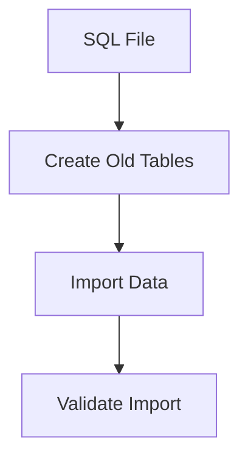
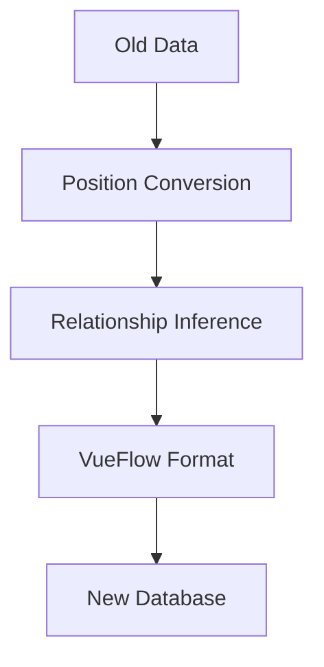
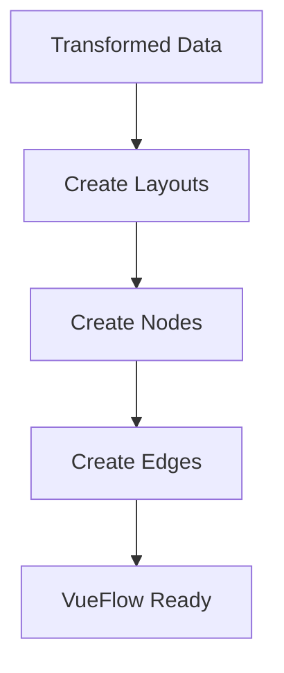

# 🌳 Family Tree Migration System

This system transforms your old family tree database into the new VueFlow-powered family tree system.

## 🚀 Quick Start

### 1. **Command Line Migration (Recommended)**

```bash
# Import old database structure first
php artisan family-tree:migrate --import-old

# Migrate a specific tree
php artisan family-tree:migrate 1

# Migrate all trees
php artisan family-tree:migrate --all

# Complete migration in one command
php artisan family-tree:migrate --import-old --all
```

### 2. **Web Interface Migration**

Visit `/migration` in your browser to use the web dashboard.

## 📋 What Gets Migrated

### **✅ Data Migration**
- **People Profiles**: All `anagrafica` records → `users` table
- **Family Trees**: Old template-based trees → VueFlow layouts
- **Tree Nodes**: Position-based people → Coordinate-based nodes
- **Tree Edges**: Inferred relationships → Explicit connections
- **Tree Templates**: Old layouts → New layout types

### **🔄 Data Transformations**
- **Names**: `nome + cognome` → `name`
- **Positions**: `alto/basso/sinistra/destra` → `x,y` coordinates
- **Relationships**: Position patterns → Family connections
- **Layouts**: Template-based → VueFlow flexible layouts

## 🏗️ System Architecture

### **Core Services**
```
app/Services/
├── OldDatabaseImportService.php          # Imports old database structure
├── FamilyTreePositionConverter.php       # Converts positions to coordinates
├── FamilyRelationshipInferenceService.php # Infers family relationships
└── CompleteFamilyTreeMigrationService.php # Orchestrates migration
```

### **Controllers & Commands**
```
app/Http/Controllers/
└── MigrationController.php               # Web interface

app/Console/Commands/
└── MigrateFamilyTreesCommand.php        # Command line interface
```

### **Views**
```
resources/views/migration/
└── dashboard.blade.php                   # Migration dashboard
```

## 🔧 Installation & Setup

### **1. Ensure SQL File is Available**
```bash
# Copy your SQL file to storage
cp "Sql1706700_3 (1).sql" storage/app/Sql1706700_3.sql
```

### **2. Run Migrations**
```bash
php artisan migrate
```

### **3. Check Dependencies**
Ensure all required models exist:
- `FamilyTreeLayout`
- `FamilyTreeNode` 
- `FamilyTreeEdge`
- `User`
- `Education`
- `DeceasedProfile`

## 📊 Migration Process

### **Phase 1: Import Old Database**


**Tables Created:**
- `anagrafica` - People profiles
- `genealogical_tree` - Tree containers
- `genealogical_tree_person` - People in trees
- `genealogical_tree_template` - Tree templates
- `genealogical_tree_template_item` - Template positions
- `citta` - Cities data

### **Phase 2: Transform Data**


**Key Transformations:**
- **Position System**: Cardinal directions → x,y coordinates
- **Relationships**: Implicit → Explicit connections
- **Layouts**: Templates → Flexible VueFlow layouts

### **Phase 3: Create New Structure**


## 🎯 Usage Examples

### **Command Line Usage**

```bash
# Check migration status
php artisan family-tree:migrate

# Import old database
php artisan family-tree:migrate --import-old

# Migrate specific tree
php artisan family-tree:migrate 1

# Migrate all trees
php artisan family-tree:migrate --all

# Complete migration
php artisan family-tree:migrate --import-old --all
```

### **Web Interface Usage**

1. **Visit** `/migration`
2. **Import** old database (if not done)
3. **View** available trees
4. **Migrate** individual trees or all at once
5. **Monitor** progress and results

## 🔍 Monitoring & Debugging

### **Logs**
Migration activities are logged to Laravel logs:
```bash
tail -f storage/logs/laravel.log
```

### **Database Queries**
Check migration results:
```sql
-- New family trees
SELECT * FROM family_tree_layouts;

-- Tree nodes
SELECT * FROM family_tree_nodes;

-- Tree edges (relationships)
SELECT * FROM family_tree_edges;
```

### **Status Check**
```bash
# Check migration status
php artisan family-tree:migrate

# API endpoint
GET /migration/status
```

## ⚠️ Important Notes

### **Data Preservation**
- **All original data is preserved** in `custom_data` fields
- **No data loss** during migration
- **Original IDs** are maintained for reference

### **Performance**
- **Large databases** may take time to migrate
- **Batch processing** for multiple trees
- **Progress tracking** for long operations

### **Rollback**
- **Migration is one-way** (old → new)
- **Backup your database** before migration
- **Test on development** environment first

## 🚨 Troubleshooting

### **Common Issues**

#### **1. SQL File Not Found**
```bash
# Ensure file exists in storage
ls -la storage/app/Sql1706700_3.sql

# Copy file if missing
cp "Sql1706700_3 (1).sql" storage/app/Sql1706700_3.sql
```

#### **2. Database Connection Issues**
```bash
# Check database configuration
php artisan config:cache

# Test connection
php artisan tinker
DB::connection()->getPdo();
```

#### **3. Migration Errors**
```bash
# Check logs
tail -f storage/logs/laravel.log

# Verify table structure
php artisan migrate:status
```

#### **4. Memory Issues**
```bash
# Increase PHP memory limit
php -d memory_limit=1G artisan family-tree:migrate --all
```

### **Debug Mode**
```bash
# Enable debug logging
php artisan family-tree:migrate --verbose
```

## 📈 Post-Migration

### **Verify Migration**
1. **Check family trees** in your VueFlow interface
2. **Verify relationships** are correctly displayed
3. **Test functionality** of migrated trees
4. **Validate data integrity**

### **Clean Up (Optional)**
```sql
-- Remove old tables after verification
DROP TABLE anagrafica;
DROP TABLE genealogical_tree;
DROP TABLE genealogical_tree_person;
DROP TABLE genealogical_tree_template;
DROP TABLE genealogical_tree_template_item;
DROP TABLE citta;
```

### **Performance Optimization**
```bash
# Clear caches
php artisan cache:clear
php artisan config:cache
php artisan route:cache

# Optimize database
php artisan migrate:status
```

## 🎉 Success Indicators

### **Migration Complete When:**
- ✅ Old database imported successfully
- ✅ All active trees migrated
- ✅ VueFlow displays family trees correctly
- ✅ Family relationships show properly
- ✅ No errors in logs
- ✅ Frontend functionality works unchanged

### **Expected Results:**
- **Complete family trees** with nodes and edges
- **Interactive VueFlow visualization**
- **All family relationships preserved**
- **Modern, flexible layout system**
- **Enhanced user experience**

## 📞 Support

### **Getting Help**
1. **Check logs** for error details
2. **Verify file paths** and permissions
3. **Test with single tree** first
4. **Review migration output** carefully

### **Reporting Issues**
Include in bug reports:
- Laravel version
- PHP version
- Database type/version
- Error logs
- Migration command used
- Expected vs actual behavior

---

**🎯 Goal**: Transform your old family tree system into a modern, interactive VueFlow-powered family tree that preserves all data while enhancing the user experience.

**🚀 Result**: A fully functional family tree system that works seamlessly with your existing VueFlow frontend!